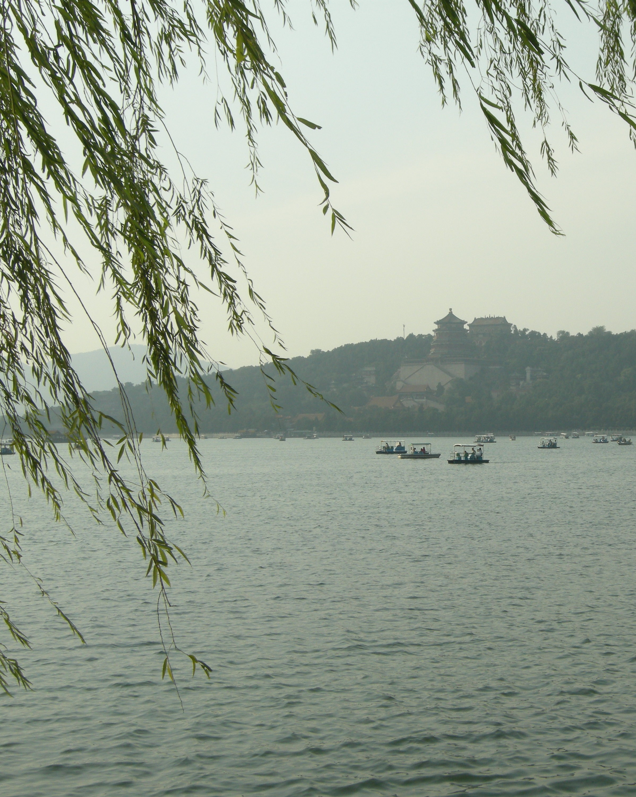

**Hello and Welcome!**

I am currently a 4th year MD/PhD student at [UT Health San Antonio](https://www.uthscsa.edu/academics/biomedical-sciences/programs/md-phd), where I am advised by [Patrick Sung](https://directory.uthscsa.edu/academics/profile/sungp) in the [Department of Biochemistry and Structural Biology](https://lsom.uthscsa.edu/biochemistry). 

My primary research interests are in DNA repair and cancer biology. I employ biochemical methods to examine protein complexes involved in HR mediated DNA repair and their overall functional impact on cancer progression.

I was formerly a research associate in the [Kosuri Lab](http://www.kosurilab.org/) at UCLA, where I worked on engineering cellular-based high throughout reporter assays for interrogating olfactory receptor activation, DMS of ADRB2, and splicing. I graduated in 2017 with a BS/MS in Biochemistry from UCLA, where I was advised by [Margot Quinlan](http://www.biochemistry.ucla.edu/Faculty/Quinlan/quinlanLab/). 

Outside of lab, I enjoy board games, anything outdoors, and cycling.

You can find my CV [here](https://github.com/jeffwang1001/jeffwang1001.github.io/blob/main/Jeff%20Wang%202022%20CV.pdf)

