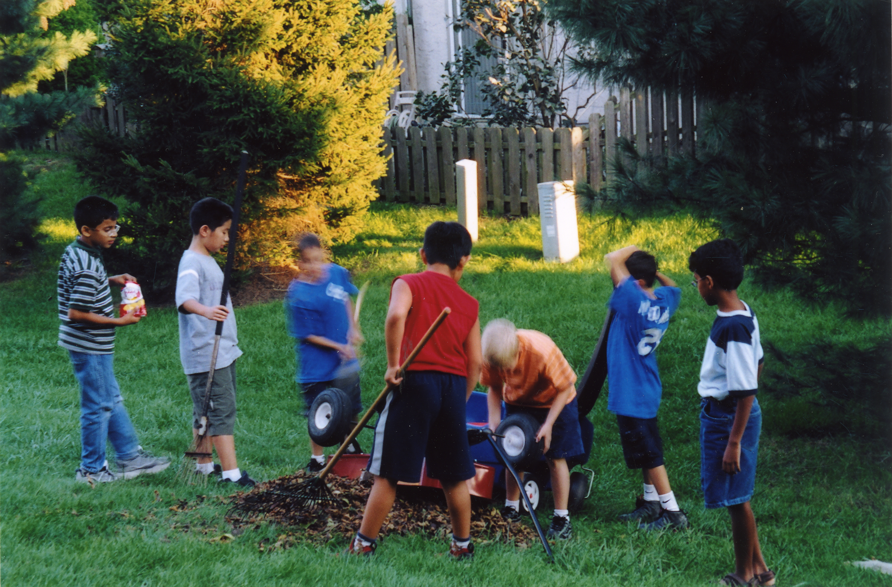

A short autobiographical piece

I was born in Chengdu, China in the early 90's. Located in the southwestern region of the country, it is the capital of the greater Sichuan province, famous for its pandas and hotpot, and my father's hometown. My stay here was fairly brief, as shortly after turning one, I relocated to Beijing to live with my maternal grandparents. There, I would spend the first several years of childhood, under the auspice of my grandparents, while my parents were hard at work establishing themselves in America and preparing an optimal living environment for my eventual reunion with them in 1999. 

     

Technically, my first steps in America was in the Detroit Metro Airport. I still remember my grandmother hurrying me along as we were trying to catch our connecting flight to Newark International Airport. It was a joyous occasion meeting my parents when we landed in Newark. Mom had visited Beijing the year prior so I was familiar with what she looked like but I was meeting dad for the first time. He greeted me with the biggeset smile at which point I noticed what looked like metal wires interspersed across the upper row of his teeth. Years later, I would wear the same metal contraption during my braces phase in middle school. The ride home was filled with chitchat between my parents and grandma. I on the other hand was intently glued to the car window, taking in all the lights, the stimuli of my new environment, and the surprising amount of space in the old buick sedan my parents owned and operated at the time. 

Home for the first year and a half was in Edison, New Jersey. There, I would attend James Madison and Wookbrook Elementary, the former for a year given the availability of ESL classes, and the latter, which was within walking distance of the townhome complex my family resided in, for 2nd grade. My time in Edison was short-lived as in the middle of 2nd grade, our family relocated to Plainsboro, NJ, 40 minutes south of Edison if one was driving along route 1. Looking back, the move was motivated by several factors. It was a smaller and safer suburb hovering around 20,000 people in the early 2000's. It drastically shortened my dad's work commute as he was working at Sarnoff, which was headquartered in the next township over, while increasing my mom's commute into the city. My tenure here would last through the end of middle school, during which I would make five life-long friendships that has already exclipsed the twenty year mark as of writing this in 2022. 

      

At the start of my freshman year of high school, I switched coast allegiances and moved to Fremont, a city suburb of the greater San Francisco Bay Area. My dad had relocated the year prior for work while my mom and I stayed an extra year in NJ for me to finish out middle school before reuniting with my dad on the west coast. I had to quickly acclimate to a new school setting and the task of making new friends. While four years can seeem like a blur, especially with the now added expectations for grades, extracurriculars and standardized tests for the eventual college apps, I nevertheless developed close friendships. Some I have still kept in close contact with while others have naturally dissipated over the course of time, distance, college, changing interests and personal development. 

  

