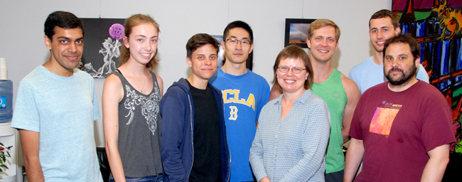
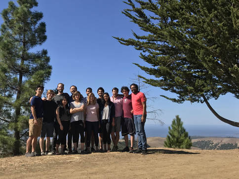
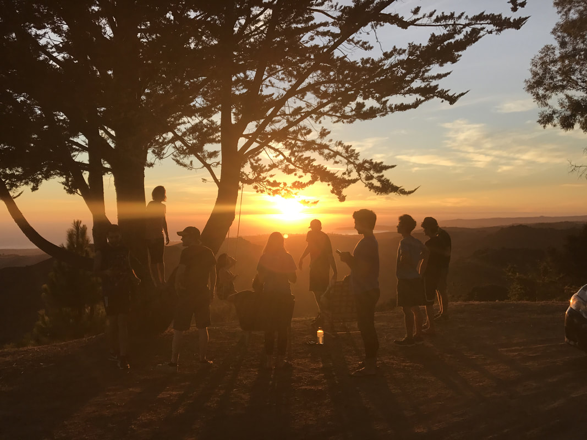
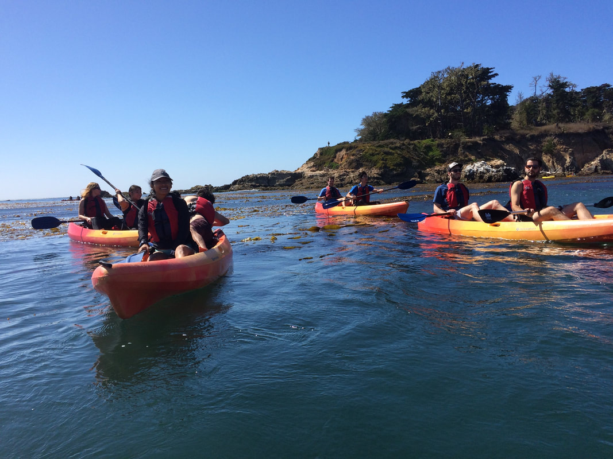
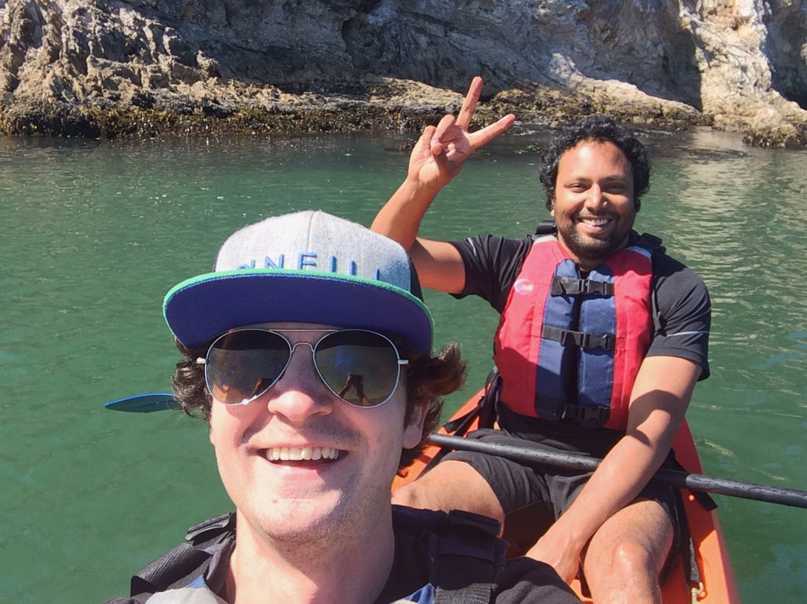
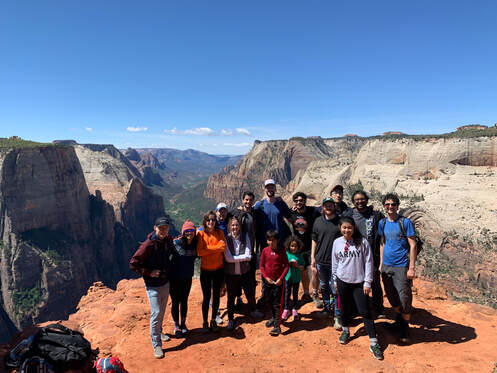

## Quinlan Lab

Departmental party after Margot recieved tenure in July of 2016! It was well deserved and I am extremely grateful to have been a part of the lab during my time as an undergrad at UCLA. It was my first lab experience and I give immense credit to Dr. Quinlan for giving me the oppurtunity to learn, explore and realize my passion for research. In addition, Dr. Silkworth (pictured on the far right) was instrumental in my development and training during my time in the lab and I credit him for my research growth and independence towards the latter half of my time in the lab. Plus, it was only right in a protein biochemistry lab to start me on a protein purification my first day in the lab! Lastly, I want to thank the entire lab for providing not only a welcoming research environment for an undergrad just starting out, but also for all the fun and lasting memories during my time at UCLA.

 

## Kosuri Lab

Lab retreat in Cambria during my first year in the lab! It was an awesome time and a great oppurtunity to interact with members of the lab as I had only been in the lab for a few months. We went tandem kayaking in the nearby state park just off the shore of the pacific. Friendly kayak battles ensued with Calin and Sri being capsized at some point after the right most photo being taken.

      

Last lab retreat in Zion National Park during my second year in the lab! It was the last lab retreat before Sri would take an indefinitive leave of absence to run his startup, Octant Bio. It was my first time in Zion and especially awesome to experience it with members of the lab. 

   

